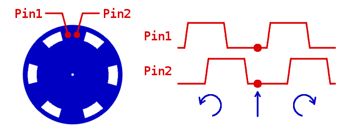

# Robopoly RomeEnco

Use this library with your [PRismino](https://github.com/Robopoly/PRismino) or any other Arduino to simultaneously interpret up to four quadrature encoders signals. 

## Installing

Installing the library is like with any [Arduino library](http://www.arduino.cc/en/Guide/Libraries), just copy `/libraries` and `/hardware` directories to your sketchbook directory:

* Windows: `My Documents\Arduino\`
* Mac: `~/Documents/Arduino/`
* Linux: `~/Documents/Arduino/`

## Wiring

Each encoder is composed of two sensors in a quadrature position. We thus have to connect two signals to our microcontroller.

## Configuring

The library uses an internal Timer of the microcontroller to regularly poll all the signals from the encoders. Each new step will asynchronously increment or decrement a counter — depending on the direction of rotation. This allows us to perform various other tasks in the `main` loop while checking the counter value from time to time.

We can select which Timer we want the library to use: `Timer0`, `1`, `3` or `4`. This can be done by uncommenting the line `#define ROM_ENCO_MAX_ENCODER_AMOUNT X` (where `X` is the Timer number) and commenting the other ones in the `RomEnco.h` header file. We have to keep in mind that Arduino functions `millis()` and `delay()` use `Timer0`, the [Servo library](http://playground.arduino.cc/ComponentLib/Servotimer1) uses `Timer1` and the `setSpeed` function from the [PRismino library](https://github.com/Robopoly/Robopoly_PRismino) uses `Timer4`.

The RomeEnco library has a debug mode which allows us to output a pulse on a specified pin each time the polling routine is triggered. This is particularly useful to check that the polling is occuring fast enough compared to the encoder signals frequency. To activate the debug mode, we simply uncomment the line `#define ROM_ENCO_DEBUG` in the header file. The output pin can be also changed with `#define ROM_ENCO_DEBUG_PIN 13`.

## Using

* We first have to create an encoder instance by declaring a `RomEnco` object. 
  * For example: `RomEnco encoder1();`

* We then specify the pins which this encoder is connected to and intiate the polling by using the `begin(pinA, pinB)` method of the class `RomEnco`. This will usually be called once in the `setup()` function.
  * If `encoder1` is connected to pins 4 and 5, we type: `encoder1.begin(4, 5);`

*  We can get the counter value with the method `getPosition()` and reset it with `resetPosition()`. The method `getIncrement()` combines the two previous ones.
  * `int counter = encoder1.getPosition();`

## Features coming soon
* Add a convenient way to change the Timer frequency
